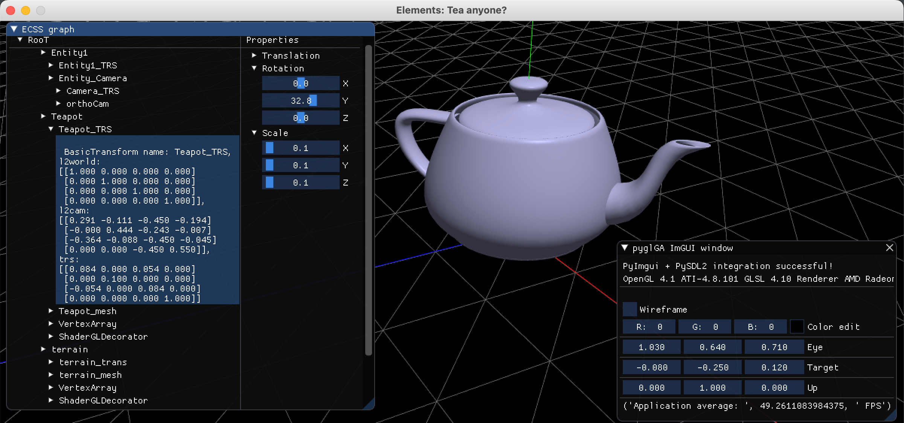

Welcome to Elements documentation!
======================================

Elements aims to combine the power of the Entity-Component-System (ECS) with the versatility of Scenegraphs, in the context of Computer Graphics (CG). It also aims to provide the basic tools to anyone that want to be involved with Computer Graphics related topics such as Machine Learning, Geometric Algebra and many many more.

Following an educational approach that can be followed by people with minimal development experience, all related packages are in Python.

.. toctree::
   :maxdepth: 2
   :caption: Getting started
   :hidden:

   source/getting_started/installation

.. toctree::
   :maxdepth: 2
   :caption: pyECSS
   :hidden:

   source/pyECSS/index
   
.. toctree::
   :maxdepth: 2
   :caption: pyGLV
   :hidden:

   source/pyGLV/index

.. toctree::
   :maxdepth: 2
   :caption: pyEEL
   :hidden:

   source/pyEEL/index

.. toctree::
   :maxdepth: 2
   :caption: API Documentation
   :hidden:

   source/api

.. toctree::
   :maxdepth: 1
   :caption: Bibliography
   :hidden:

   source/bibliography/bibliography

.. toctree::
   :maxdepth: 1
   :caption: Change log
   :hidden:

   source/changelog/changelog

