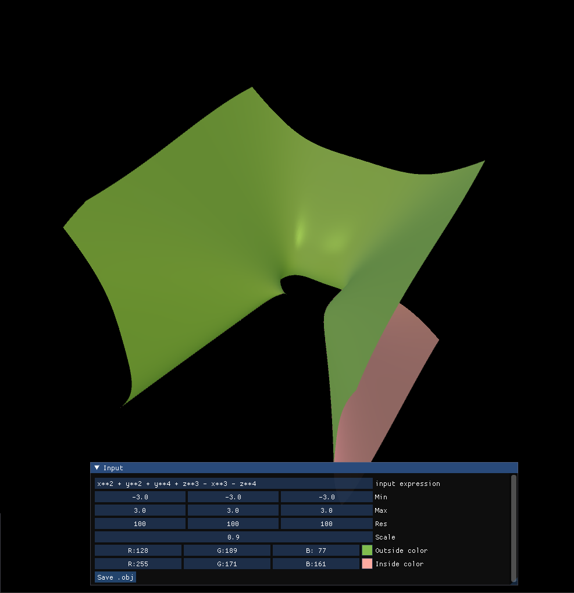

# Implicit Surface Generation

*author: [Kostis Lymperakis](https://github.com/kostis1101)*

## Marching Cubes

*screenshot from the example `example_marching.py`*

The class `MarchingCubes` is a wrapper around the `VertexArray` component. It holds all the necessary functionality to create a mesh (and update the corrisponding `VertexArray`) by approximating the roots of an expression of 3 real variables. It uses a simple implementation of the marching cubes algorithm.

**Usage:**
- Create a `MarchingCubes` instance on a existing `VertexArray` component
- Call the `update_surface` method of the `MarchingCubes`

**Parameter of the `update_surface` method:**
- expression: *str*
	string with the expression. Variables are `x`, `y`, and `z`. A table with supported methods is below.
- minv: *tuple of floats*
	Minimum coordinates of the bounding box
- maxv: *tuple of floats*
	Maximus coordinates of the bounding box
- res: *tuple of ints*
	The resolution (number of samples) per axis
- normals: *bool, optional*
	If true, approximates the normals from the grid values (better for performance, similar quality)
- use_taichi: *bool, optional*
	If true, uses the taichi JIT (increases performance substantially)

*__Note:__ The marching cubes algorithm, especially a relatively simple implementation like this one, works best with  differentiable functions. Though unlikely, other  functions might cause artifacts or even cause the algorithm to outright fail*

## 2D Function Plotting

The class `RealFunction2D` is a wrapper around the `VertexArray` component. It generates a plot of a 2d function .

**Usage:**
- Create a `RealFunction2D` instance on a existing `VertexArray` component
- Call the `update_surface` method of the `RealFunction2D`

**Parameters of the `update_surface` method:**
- expression: *str*
	string with the function expression
- minv: *tuple of float*
	Minimum coordinates of the grid points
- maxv: *tuple of float*
	Maximum coordinates of the grid points
- res: *tuple of ints*
	The resolution (number of samples) per axis
- normals: *bool, optional*
	If true, approximates the normals from the grid values (better for performance, similar quality)

*__Note:__ Since the implementation of this is the most naive one (creates a grid of points and displaces it upwards), functions with large second derivatives (generally whose absolute Gaussian curviture is locally quite large) will result in some artifacts in the mesh*

## Supported Functions

Supported functions:
- sin, cos, tan, arcsin, arccos, arctan
- sinh, cosh, tanh, arcsinh, arccosh, arctanh
- floor, ceil, rint
- exp, exp2, log, log10, log2, sinc
- gcd, lcm, mod, remainder
- power
- maximum, minimum
- sqrt, cbrt

If it exists, the `numexpr` library is used to evaluate expressions. Otherwise, the build in `eval` is used. In the second case, one is able to use any numpy function by importing it (e.g. use "np.argwhere" in the expression string instead of "argwhere").

## Wavefront file saving

Both the `MarchingCubes` and the `RealFunction2D` have a method called `save_to_obj`. This saves the mesh to a `.obj` file with the desired filename.

## Shaders

The implementation comes with one shader (a vertex and a fragment shader). This is used to make the resulting surface easier to distinguish. It uses a simple Binn-Phone shader, but where the different sides of the surface get different colours. One can choose the colours through the `colour_front` and `colour_back` uniform variables. See the example files for full usage.

## Benchmarks

This is for the marching cubes implementation (avg of 100 iterations, see benchmark file under tests):

|  Resolution   |  Voxel Count  | Time (per iteration) |
|:-------------:|:-------------:|:--------------------:|
|    30x30x30   |      27.000   |         4.21 ms      |
|    50x50x50   |     125.000   |         8.81 ms      |
|    70x70x70   |     343.000   |        17.53 ms      |
|  100x100x100  |   1.000.000   |        40.69 ms      |
|  150x150x150  |   3.375.000   |       116.73 ms      |
|  200x200x200  |   8.000.000   |       256.04 ms      |

## Examples

There are two examples. Each has some custom GUI to be able to interact with the surface generation in real time. Just run the examples with `python3 example_marching.py` or `python3 example_fuction_graph.py`.
