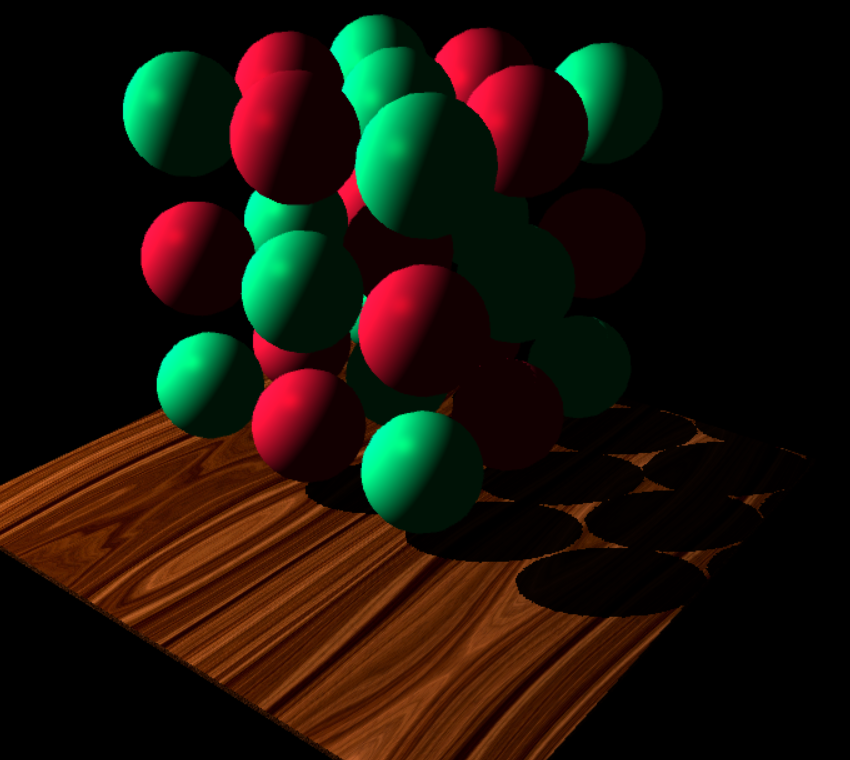
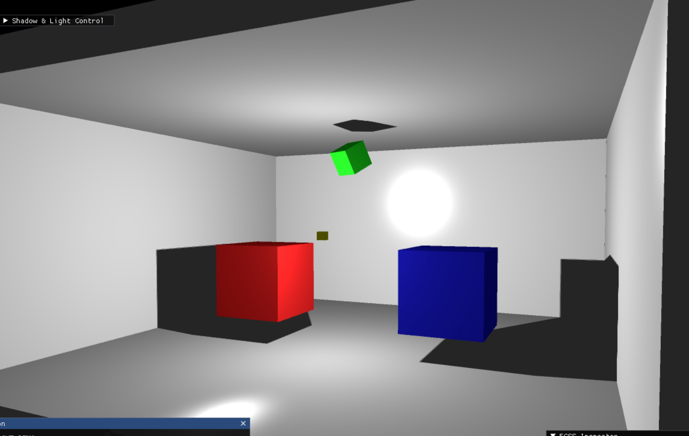
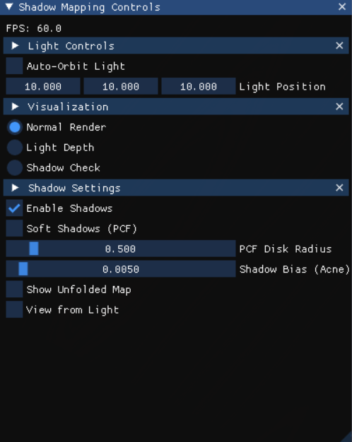

# Shadow Mapping Extension

## 1. Description

This extension provides a complete implementation of shadow mapping for the Elements engine. It supports both **Directional Lights** (for distant, parallel light sources like the sun) and **Point Lights** (for omnidirectional light sources like a lightbulb).

The implementation uses a standard two-pass rendering technique:
1.  **Depth Pass:** The scene is rendered from the light's point of view into a depth texture (the shadow map). For directional lights, this is a 2D texture using an orthographic projection. For point lights, a cubemap texture is generated using a geometry shader to render the scene in all 6 directions simultaneously.
2.  **Lighting Pass:** The scene is rendered from the camera's perspective. The standard Phong shading is augmented with a shadow calculation. Each fragment's position is transformed into light space, and its depth is compared to the stored value in the shadow map to determine if it is in shadow.

## 2. Contributors

- **Names & Emails:** Drakakis Emmanouil (csd5212@csd.uoc.gr), Roussakis Nikolaos (csd5143@csd.uoc.gr)

## 3. Usage Instructions

This extension includes two example scenes that demonstrate the shadow mapping capabilities. The first example, `example_1_PointLightDemo.py`, has a room with cubes to demonstrate omnidirectional point lights. To see and switch between
point and directional lights, refer to the second example, `example_2_Sphere3x3x3Demo.py`, in which the scene is not confined to
a small space.


### How to Run the Examples

To run the examples, execute the Python scripts from the root directory of the project:

**3x3x3 Sphere Demo (Directional & Point):**

macOS/Linux:
```bash
python Elements/extensions/Shadows/example_2_Sphere3x3x3Demo.py
```

Windows:
```bash
python Elements\extensions\Shadows\example_2_Sphere3x3x3Demo.py
```

*A 3x3x3 grid of spheres casting shadows from a directional light.*



**Point Light Demo:**

macOS/Linux:
```bash
python Elements/extensions/Shadows/example_1_PointLightDemo.py
```

Windows:
```bash
python Elements\extensions\Shadows\example_1_PointLightDemo.py
```

*A room scene with shadows cast by a central point light.*


*ImGui Control Panel*



## 4. Controls

The examples include a real-time ImGUI control panel that allows for interactive exploration of the shadow mapping technique.

### Features
- **Enable/Disable Shadows:** Toggle shadows on and off.
- **Soft Shadows (PCF):** Enable Percentage-Closer Filtering to soften the edges of shadows. The softness can be adjusted.
- **Shadow Bias:** Adjust the shadow bias to mitigate "shadow acne" artifacts.
- **Light Control:** Animate the light source or move it manually using sliders.
- **Visualizations:**
    - **Normal Render:** Standard scene view with shadows.
    - **Light Depth:** View the raw depth map generated in the first pass.
    - **Shadow Check:** A visualization mode that colors fragments green if they are lit and red if they are in shadow.
    - **Unfolded Map:** For point lights, this shows a 2D "cross" layout of the 6 faces of the shadow cubemap.

## 5. Tests

This extension includes unit tests to ensure the core shader component functionality is working as expected. The tests are located in the `tests/` directory.

### Running the Tests

To run the tests, execute `pytest` from the project root directory. Using `python -m` ensures that your project's import paths resolve correctly:

```bash
python -m pytest Elements/extensions/Shadows/tests/test_shader_component.py
```

For more detailed output, you can add the `-v` flag:

```bash
python -m pytest -v Elements/extensions/Shadows/tests/test_shader_component.py
```

---

### Test Coverage

The `test_shader_component.py` file includes the following checks:

- **Constructor Test:** Verifies that the `ShadowShader` component is initialized correctly with the provided shader source strings.  
- **OpenGL Initialization:** Mocks the PyOpenGL (`gl`) module to confirm that the `init()` method correctly calls the underlying OpenGL functions for shader compilation, attachment, and linking.  
- **Default Shader Loading:** Ensures that if no custom shader code is provided, the component correctly falls back to its default Phong lighting shaders upon initialization.  

These tests utilize mocking to run without a live OpenGL context or heavy 3D engine initialization, allowing for fast, automated validation in different environments.
