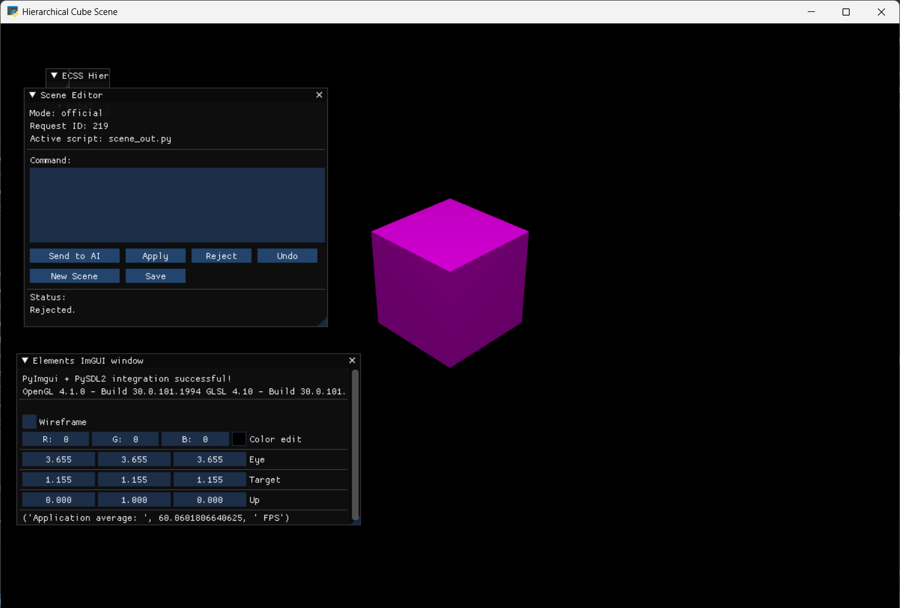

# textToScene

`textToScene` is an extension inside the `Elements` repository. It lets a user describe a 3D scene in plain text and see it rendered live inside an OpenGL window powered by the `Elements` framework.

The core idea is a **hierarchical scene IR** (intermediate representation). A scene is a tree of nodes. The system converts that IR into executable Python/OpenGL code, renders it, and supports an interactive edit loop: type a command → see a preview → apply or reject.

**Demo videos:** https://www.youtube.com/playlist?list=PLf1EzQl7CZ7MkCu0miatQ6SBcNevK5I1s

---

## Table of contents

1. [Features](#features)
2. [Architecture](#architecture)
3. [Project structure](#project-structure)
4. [Prerequisites & installation](#prerequisites--installation)
5. [Configuration & environment](#configuration--environment)
6. [How to run](#how-to-run)
7. [Scene IR format](#scene-ir-format)
8. [Supported shapes](#supported-shapes)
9. [Supported lights](#supported-lights)
10. [Prefabs](#prefabs)
11. [Supported text commands](#supported-text-commands)
12. [Bridge protocol (shared runtime files)](#bridge-protocol)
13. [Testing & evaluation](#testing--evaluation)
14. [For future developers](#for-future-developers)
15. [Troubleshooting](#troubleshooting)

---

## Features

- Hierarchical scene IR with groups, mesh objects, and lights
- Deterministic Python/OpenGL code generation for `Elements`
- Live preview/apply/reject workflow for text-driven edits
- Undo support through a persistent snapshot stack
- Prefab library (house, tree, bench, table, lamp, street light, …)
- Basic directional and point lighting
- Textured 3D model support (USDZ with embedded textures — Phong shading, smooth normals)
- Per-frame light orbit animation baked into every textured shader
- Object animations: bounce, spin, orbit, and interpolated (lerp) movement
- Orbiting light support: any light can be set to orbit a target object
- Bundled 3D model library (chameleon, baseball, teapot, Frank) — load by name
- LLM-backed parsing (Google Gemini / OpenAI) with prompt-level caching
- Full evaluation harness with baseline and few-shot modes

---

## Architecture

The system runs as **three independent processes** that communicate through JSON files in `extensions/textToScene/runtime/scene_bridge/`. No sockets or shared memory are used.


### Edit loop (step by step)

1. User types a command in the ImGui panel inside the scene window.
2. The scene writes `ai_request.json` with `status: "pending"`.
3. The controller picks it up, parses it (text rules or LLM), and builds a new scene IR.
4. The controller writes `preview_scene_ir.json` and generates `preview_scene.py`.
5. The controller updates `scene_state.json` → `mode: "preview"`.
6. The supervisor detects the mode change, kills the current scene process, and launches `preview_scene.py`.
7. The user sees the preview and clicks **Apply**, **Reject**, or **Undo**.
8. The scene writes that choice to `ui_state.json`.
9. The controller acts on the choice and resets `scene_state.json` → `mode: "official"`.
10. The supervisor relaunches `scene_out.py`.

---

## Project structure

```
extensions/textToScene/
├── README                         this file
├── requirements.txt               Python dependencies
├── pytest.ini                     test discovery config
├── .env                           API keys (not committed — see below)
│
├── docs/
│   ├── architecture.md            deeper architecture notes
│   └── bridge_protocol.md        full spec for every shared file
│
├── src/
│   ├── config.py                  all paths, model names, constants
│   ├── code_generator.py          IR → executable Elements Python script
│   ├── geometry_factory.py        low-level mesh / normal / UV helpers
│   ├── ir_schema.py               IR node schema and validation helpers
│   ├── llm_parser.py              OpenAI integration + prompt-level cache
│   ├── mock_ai_contoller.py       main controller loop (entry point 2)
│   ├── prefabs.py                 prefab builder functions
│   ├── supervisor.py              process supervisor (entry point 3)
│   ├── text_parser.py             rule-based text → IR (no LLM)
│   ├── scene_ir.json              default/initial scene IR on disk
│   │
│   └── legacy/                    standalone scene scripts (run independently)
│       ├── tester_1.py            minimal scene — official entry point 1
│       ├── tester2_group.py       group transform test
│       ├── tester3_geom1.py       geometry primitives test
│       ├── tester4_allShapes.py   all supported shapes side by side
│       ├── tester5_house.py       house prefab test
│       ├── tester6_prefabs.py     village street scene (all prefabs)
│       ├── tester7_pointlight.py  point light test
│       ├── tester8_directional.py directional light test
│       ├── tester9_texture_cube.py textured cube test
│       ├── tester10_demo.py       full demo scene
│       └── tester11_nice_scene.py neighbourhood park (cover scene)
│
└── tests/
    ├── test_suite.py              full test runner
    ├── test_prefabs.py            prefab builder tests
    ├── test_prefabs_detail.py     prefab structure detail tests
    ├── test_text_parser.py        rule-based parser tests
    ├── test_code_generator.py     code generation tests
    ├── test_validate_action.py    action validation tests
    ├── test_apply_action.py       IR mutation tests
    ├── test_ir_helpers.py         IR utility function tests
    ├── test_light_actions.py      light add/edit/remove tests
    ├── test_texture_actions.py    texture application tests
    ├── test_move_up_down.py       vertical movement tests
    ├── test_scale_object.py       scale action tests
    ├── test_rotate_object.py      rotation action tests
    ├── evaluation_runner.py       automated evaluation harness
    ├── evaluate_baseline.py       baseline (no few-shot) evaluation
    └── evaluate_fewshot.py        few-shot LLM evaluation
```

---

## Prerequisites & installation

### 1. Install the Elements framework

Clone the Elements repository and install it with pip. Running `pip install -e .` from the folder that contains `setup.py` installs the framework in editable mode and pulls in all required packages — PySDL2, PyOpenGL, and numpy — automatically:

```bash
git clone <elements-repo-url>
cd Elements          # the folder that contains setup.py
pip install -e .
```

### 2. Install textToScene dependencies

Navigate into the extension folder and install its dependencies:

```bash
# Windows
cd Elements\extensions\textToScene

# macOS / Linux
cd Elements/extensions/textToScene
```

```bash
pip install -r requirements.txt
```

`requirements.txt` includes `google-genai`, `openai`, `python-dotenv`, `imgui`, `numpy<2.0`, and other packages needed by the NL pipeline.

> **Note — numpy version:** numpy 2.x breaks binary compatibility with some OpenGL bindings. The `requirements.txt` pins `numpy<2.0` which forces installation of 1.26.4. If you ever see `AttributeError` or `ImportError` related to numpy after an upgrade, run `pip install "numpy<2.0"` to downgrade.

---

## Configuration & environment

### API keys (`.env`)

Create a file called `.env` in `extensions/textToScene/` (it is gitignored):

```
GEMINI_API_KEY=your-google-ai-key-here
OPENAI_API_KEY=sk-...
```

`config.py` loads this file automatically via `python-dotenv` at startup.

**To verify the keys are loaded correctly**, run this from `extensions/textToScene/` (do **not** run from inside `src/` — the `.env` file lives one level up):

```bash
python -c "from dotenv import load_dotenv; load_dotenv('.env'); import os; print('Gemini key present:', bool(os.environ.get('GEMINI_API_KEY'))); print('OpenAI key present:', bool(os.environ.get('OPENAI_API_KEY')))"
```

If both print `False`, the `.env` file is missing or is in the wrong directory. Make sure it is at `extensions/textToScene/.env`, not inside `src/`.

If you skip the API key the controller still runs — it falls back to rule-based parsing for simple commands. You will see a yellow warning in the controller terminal whenever the LLM is not reached.

### Choosing an LLM model (`src/config.py`)

Open `src/config.py` and uncomment the `DEFAULT_MODEL` line for the backend you want. Make sure the matching API key is in `.env`.

```python
# Google Gemini (best accuracy in evaluation — requires GEMINI_API_KEY):
DEFAULT_MODEL = "gemini-2.5-flash-lite"   # default — fast
# DEFAULT_MODEL = "gemini-2.5-flash"      # larger, slower

# OpenAI (requires OPENAI_API_KEY):
# DEFAULT_MODEL = "gpt-4o-mini"
# DEFAULT_MODEL = "gpt-4.1-mini"
```

### Runtime file locations

All bridge files are written to `~/.textToScene/` (inside the user's home directory). The directory is created automatically on first run.

| Constant | Location | Description |
|---|---|---|
| `SHARED_DIR` | `~/.textToScene/scene_bridge/` | All shared JSON files |
| `SCENE_OUT_FILE` | `~/.textToScene/scene_out.py` | Generated official scene |
| `POLL_INTERVAL` | `0.5 s` | Seconds between controller polls |

On Windows this resolves to `C:\Users\<you>\.textToScene\`.

---

## How to run

All commands below are run from `extensions/textToScene/` — **never** `cd` into `src/`.

### Full interactive mode (3 terminals)

You need three terminals, all opened in `extensions/textToScene/` with the conda env active:

**Terminal 1 — generate the initial scene:**

```bash
# Windows
python src\legacy\tester_1.py

# macOS / Linux
python src/legacy/tester_1.py
```

Run this once at the start of each session or when you want to reset the scene.

**Terminal 2 — start the controller:**

```bash
# Windows
python src\mock_ai_contoller.py

# macOS / Linux
python src/mock_ai_contoller.py
```

Keep this running. It polls for AI requests and updates the scene IR. If the LLM key is missing or unreachable, you will see a warning and the system falls back to rule-based parsing.

**Terminal 3 — start the supervisor:**

```bash
# Windows
python src\supervisor.py

# macOS / Linux
python src/supervisor.py
```

The supervisor launches the scene and manages process switching between official and preview modes. You will now see the `Elements` OpenGL window.

> **Initial scene:** The default scene is empty (no objects). Type a command like `add a red cube` or `load a chameleon` to place something. The ImGui text box is in the top-left of the window.
>
> 

Type a command in the ImGui text box and press Enter.

**To stop the system:** press `Ctrl+C` in the supervisor terminal (Terminal 3). Pressing `Esc` inside the scene window will be caught by the supervisor and the window will reopen — use `Ctrl+C` to fully exit.

### Run a legacy/demo scene directly

Any script in `src/legacy/` is self-contained (no controller or supervisor needed):

```bash
# Windows
python src\legacy\tester6_prefabs.py       # village street scene
python src\legacy\tester11_nice_scene.py   # neighbourhood park

# macOS / Linux
python src/legacy/tester6_prefabs.py
python src/legacy/tester11_nice_scene.py
```

---

## Scene IR format

A scene is a JSON tree. The root is always a `scene` node.

```json
{
  "node_type": "scene",
  "name": "root",
  "window": { "width": 1280, "height": 720, "title": "My Scene" },
  "children": [ ... ]
}
```

### Node types

#### `mesh_object`

```json
{
  "node_type": "mesh_object",
  "name": "my_cube",
  "shape": "cube",
  "transform": {
    "position": [0.0, 0.5, 0.0],
    "scale":    [1.0, 1.0, 1.0],
    "rotation": [0.0, 0.0, 0.0]
  },
  "material": {
    "color": [1.0, 0.0, 0.0]
  }
}
```

`rotation` is optional (defaults to `[0, 0, 0]`).

#### `group`

Groups let you position and scale multiple objects together:

```json
{
  "node_type": "group",
  "name": "my_group",
  "transform": { "position": [1.0, 0.0, 0.0], "scale": [1.0, 1.0, 1.0] },
  "children": [ ... ]
}
```

#### `light`

```json
{
  "node_type": "light",
  "name": "sun",
  "light_type": "directional",
  "properties": {
    "direction": [-0.5, -0.7, -0.5],
    "color":     [1.0, 0.9, 0.7],
    "intensity": 1.5
  }
}
```

For `point` lights use `"position"` instead of `"direction"`.

---

## Supported shapes

| Shape name | Description |
|---|---|
| `cube` | Unit cube |
| `rectangular_prism` | Box with independent XYZ scale |
| `sphere` | UV sphere |
| `cylinder` | Circular cylinder |
| `cone` | Circular cone |
| `pyramid` | Square-base pyramid |
| `triangular_pyramid` | Triangular-base pyramid (tetrahedron) |
| `plane` | Flat ground plane |

All shapes sit at the origin by default. Use `transform.position` to place them.

---

## Supported lights

| `light_type` | Required properties | Notes |
|---|---|---|
| `directional` | `direction`, `color`, `intensity` | Simulates sun/sky. Direction is where the light travels (e.g. `[0,-1,0]` = straight down). |
| `point` | `position`, `color`, `intensity` | Radiates in all directions from a point. |

**Intensity guidelines:** values around `1.0–1.8` for the main light and `0.5–0.9` for fill give natural results. Values above `3.0` will wash out colors.

---

## Prefabs

Prefabs are Python functions in `src/prefabs.py`. Each returns a complete group node ready to embed in a scene IR.

| Function | Arguments | Description |
|---|---|---|
| `build_house(name, position)` | name: str, position: [x,y,z] | Rectangular body + pyramid roof |
| `build_tree(name, position)` | name: str, position: [x,y,z] | Cylinder trunk + sphere crown |
| `build_street_light(name, position)` | name: str, position: [x,y,z] | Pole + arm + lamp head |
| `build_bench(name, position)` | name: str, position: [x,y,z] | Seat slab + two leg supports |
| `build_chair(name, position)` | name: str, position: [x,y,z] | Seat + backrest + four legs |
| `build_table(name, position)` | name: str, position: [x,y,z] | Table top + four legs |
| `build_lamp(name, position)` | name: str, position: [x,y,z] | Base cylinder + pole + cone shade |
| `build_bed(name, position)` | name: str, position: [x,y,z] | Frame + mattress + headboard + pillow |
| `build_gift_box(name, position)` | name: str, position: [x,y,z] | Box + ribbon cross |

**Usage example:**

```python
from prefabs import build_house, build_tree

scene_ir["children"] += [
    build_house("house1", [-2.0, 0.0, -1.5]),
    build_tree("tree1",   [ 1.5, 0.0, -2.0]),
]
```

---

## Supported text commands

These are typed into the ImGui text box inside the running scene window.

### Object commands

```
add a red cube
add a large blue sphere
add a green cylinder to the right of the cube
add a yellow cone on top of the sphere
move the red cube to the left
move the cube up
move the cube forward
scale the sphere up
scale the cube down
rotate the cube 45 degrees
change the cube color to blue
change the color of the red sphere to orange
delete the red cube
delete the sphere
```

### Prefab commands

```
add prefab tree
add prefab house
add prefab bench
add prefab street light
```

### Animations

```
make the cube bounce
make the cube go up and down
make the sphere bob
make the cube spin
make the cube rotate continuously
make the cube spin on its axis
make the cube move smoothly to the right
make the cube move back and forth
```

### Orbit

Objects or lights can orbit (circle around) another object:

```
add a sphere that rotates around the cube
add a sphere that orbits the cube
add a sphere that circles the cube
add a light that rotates around the cube
add a spotlight that revolves around the sphere
```

### Load bundled 3D models

```
load a chameleon
add a chameleon
load the teapot
add a baseball
load frank
```

Available bundled models: `chameleon`, `baseball` / `ball`, `teapot`, `frank`.

### Extra lights

```
add a light
add a spotlight
turn on the lights
illuminate the scene
```

### Scene management

```
save scene
save scene my_tower
load scene my_tower
new scene
undo
```

### Object references

The controller resolves natural references to objects in the scene:

```
the cube              → first cube in the scene
the red cube          → cube with red material
the green sphere      → sphere with green material
the first cube        → first added
the last cube         → most recently added
the most recently added object
```

If multiple objects match, the controller picks deterministically and logs its choice.

---

## Bridge protocol

The three processes communicate entirely through files in `~/.textToScene/scene_bridge/`. The full specification (owners, formats, status values) is in:

```
docs/bridge_protocol.md
```

Quick reference:

| File | Writer | Purpose |
|---|---|---|
| `scene_ir.json` | Controller | Authoritative committed scene state |
| `preview_scene_ir.json` | Controller | Pending preview (temporary) |
| `ai_request.json` | Scene / Controller | Request + status handshake |
| `ui_state.json` | Scene / Controller | Apply / reject / undo decision |
| `scene_state.json` | Controller | Tells supervisor which script to run |
| `history/undo_stack.json` | Controller | Snapshot stack for undo |
| `cache/action_cache.json` | Controller | LLM response cache (keyed by prompt) |

---

## Testing & evaluation

Run all unit tests from `extensions/textToScene/` (where `pytest.ini` lives):

```bash
# activate the env first
conda activate elementtest

# run all tests
pytest
```

Or target a single file:

```bash
pytest tests/test_code_generator.py
pytest tests/test_apply_action.py -v
```

### Evaluation harness

The evaluation scripts measure how accurately the system parses and executes natural-language commands. Run from `extensions/textToScene/`:

```bash
# Windows
python tests\evaluate_baseline.py   # no few-shot examples
python tests\evaluate_fewshot.py    # few-shot — Gemini only, requires GEMINI_API_KEY

# macOS / Linux
python tests/evaluate_baseline.py
python tests/evaluate_fewshot.py
```

`evaluate_fewshot.py` uses the Gemini model only (not OpenAI). If `GEMINI_API_KEY` is not set in `.env`, the script prints a warning and exits without running any tests.

Results are written to `docs/all_results.json`.

---

## For future developers

### Getting oriented

1. Read `docs/architecture.md` and `docs/bridge_protocol.md` first.
2. Run `python src/legacy/tester4_allShapes.py` to see all shapes, then `python src/legacy/tester6_prefabs.py` for the village scene. These require no controller or supervisor.
3. Run the full system once (`tester_1.py` + `mock_ai_contoller.py` + `supervisor.py`) and try a few commands to understand the live loop.

### Adding a new shape

1. Add the shape name to the IR schema in `ir_schema.py` if validation is enforced there.
2. In `code_generator.py` find the mesh dispatch block and add a branch for the new shape name that calls the appropriate `geometry_factory` function.
3. In `geometry_factory.py` implement the geometry (vertices, faces, normals).
4. Add a test case in `tests/test_code_generator.py`.
5. Add a legacy tester entry in `tester4_allShapes.py` to verify visually.

### Adding a new prefab

1. Add a `build_<name>(name, position)` function to `src/prefabs.py`. It must return a `group` node dict.
2. Import and expose it in any script that needs it.
3. Add the trigger keyword in `mock_ai_contoller.py` under the `add prefab` command handler so users can summon it by text.
4. Add a test in `tests/test_prefabs.py`.

### Adding a new action type

1. Define the action schema in `ir_schema.py`.
2. Add a handler in `mock_ai_contoller.py` inside `apply_action_to_ir()`.
3. Add the LLM prompt example in `llm_parser.py` so the model knows to emit the new action.
4. Add unit tests in `tests/test_apply_action.py` and `tests/test_validate_action.py`.
5. Add evaluation examples in `tests/evaluate_fewshot.py`.

### Key design decisions to be aware of

- **All state lives in JSON files on disk.** There is no in-memory shared state between the three processes. If you add a new piece of state, add a new file or field in `~/.textToScene/scene_bridge/` and document it in `docs/bridge_protocol.md`.
- **The supervisor always restarts the scene from scratch.** There is no hot-reload. When mode changes, the old process is killed and a new one is launched. This is intentional — it avoids incremental OpenGL state corruption.
- **The LLM is a fallback, not the primary path.** Simple commands (add, move, delete, color) are handled by `text_parser.py` without any API call. The LLM is only invoked when rule-based parsing fails.
- **The action cache (`cache/action_cache.json`) persists across sessions.** If you change the LLM prompt or action schema, delete this file so stale cached responses are not replayed.

### Running a quick manual test (no full system)

From `extensions/textToScene/`:

```bash
# Windows
python -c "import sys; sys.path.insert(0,'src'); from code_generator import generate_scene_script; ir={'node_type':'scene','name':'root','window':{'width':800,'height':600,'title':'test'},'children':[]}; print(generate_scene_script(ir)[:200])"

# macOS / Linux
python -c "import sys; sys.path.insert(0,'src'); from code_generator import generate_scene_script; ir={'node_type':'scene','name':'root','window':{'width':800,'height':600,'title':'test'},'children':[]}; print(generate_scene_script(ir)[:200])"
```

---

## Troubleshooting

### `NameError: name 'PROJECT_DIR' is not defined` or `ModuleNotFoundError: No module named 'config'`

You are running from inside `src/` instead of `extensions/textToScene/`. Always run with the full `src/` prefix: `python src/supervisor.py`, not `cd src && python supervisor.py`.

### Scene window does not open

- Check that `~/.textToScene/scene_out.py` exists — run `python src/legacy/tester_1.py` first.
- Check the supervisor terminal for Python tracebacks.
- Make sure the conda environment is active: `conda activate elementtest`.

### Commands are ignored / controller shows no output

- The controller polls every 0.5 s. Check the controller terminal for errors.
- Make sure `~/.textToScene/scene_bridge/ai_request.json` is being written by the scene.

### LLM parsing always fails

- Verify keys are loaded: `python -c "from dotenv import load_dotenv; load_dotenv('.env'); import os; print(bool(os.environ.get('GEMINI_API_KEY')))"`
- The controller logs `[llm]` prefixed lines — look for HTTP error codes.
- Delete `~/.textToScene/scene_bridge/cache/action_cache.json` if you suspect a stale cached bad response.

### `pip install google-genai` fails with Python version error

You need Python 3.9. Check your active environment: `python --version`. If it shows 3.10 or later, you are in the wrong conda env — run `conda activate elementtest`.

---

## Notes

- The `src/legacy/` scripts are **standalone**: they do not require the controller or supervisor. Use them for quick visual testing of shapes, lights, or prefabs.
- `src/text_parser.py` exists as a standalone text-to-IR utility but is not the primary parsing path in the interactive loop. The interactive loop goes through `mock_ai_contoller.py` which calls `llm_parser.py`.
- All generated scene scripts target the `Elements` framework and will not run outside of a correctly installed `Elements` environment.