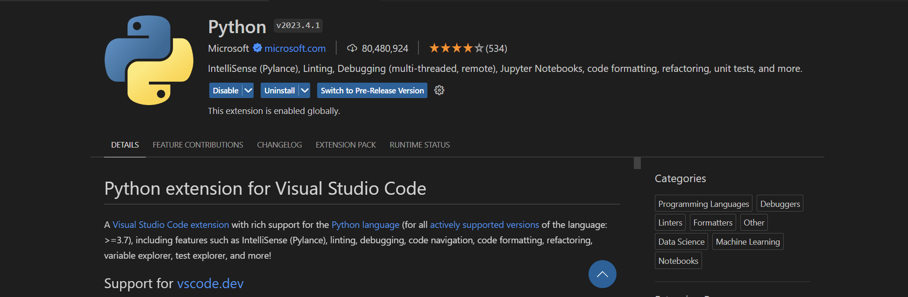
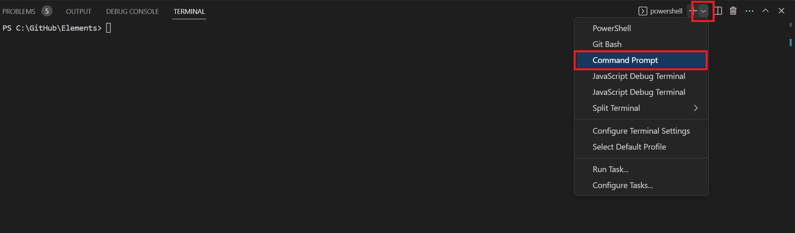
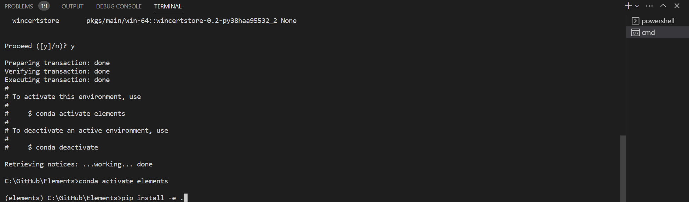
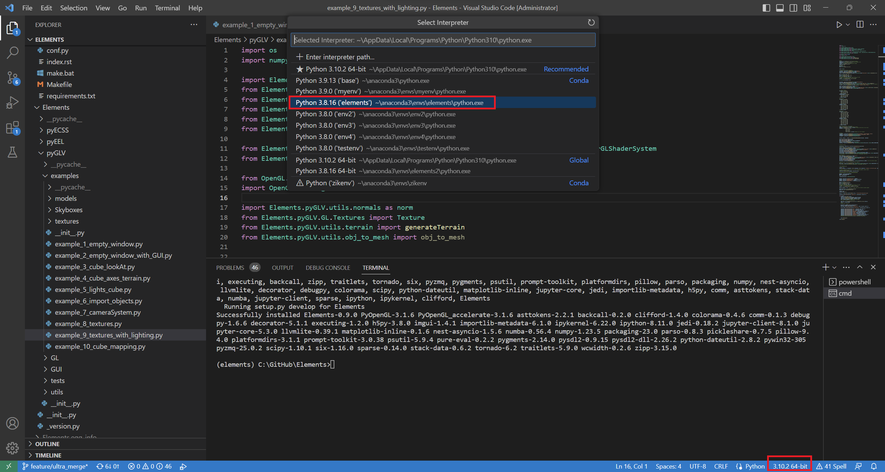
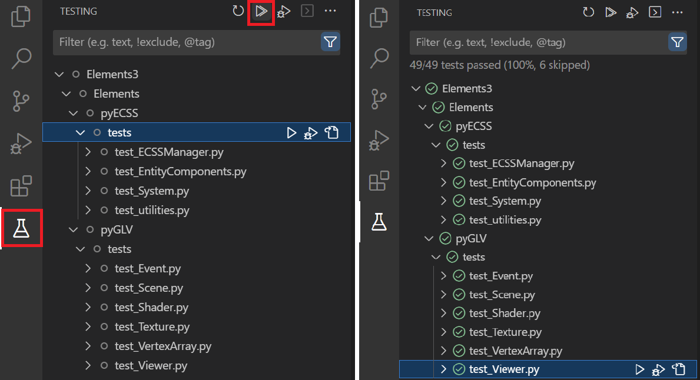
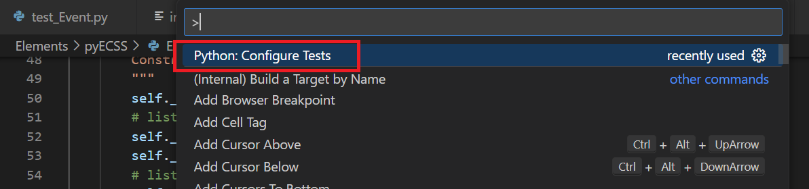
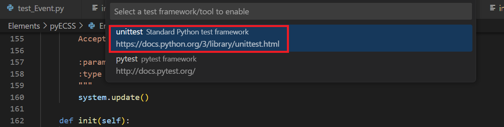
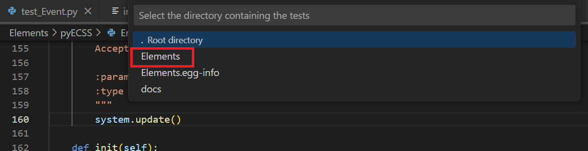
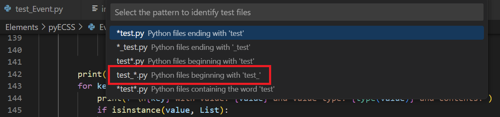
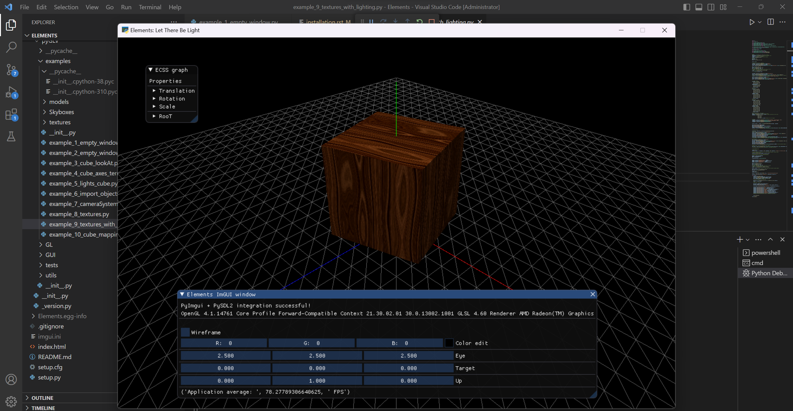

Installation
============

OS requirements
------------------------------

The Elements framework has been tested on the following operating systems:

1. Windows 11
2. Max OS Monterey-Ventura
3. Ubuntu 22

Clone the repository
------------------------------

Clone the Elements repository from the following link: 

`https://github.com/papagiannakis/Elements <https://github.com/papagiannakis/Elements>`_.

Visual studio code preparation
--------------------------------

Download the python extension in your visual studio code

Open the Elements folder with the visual studio code

Creating a Conda Environment
----------------------------------------

We suggest to download the Anaconda package management system to keep your system clean (optional step)

Download the proper `Anaconda python distribution <https://www.anaconda.com/distribution/#download-section>`_ based on your system.

Installation
--------------------------------

Open a new command prompt in visual studio code

Create a new elements conda environment with the command::

    conda create -n elements python=3.8

This creates a new environment, named elements, with a python version 3.8, which is the proper version to run Elements.

You may now activate the environment by running::

    conda activate elements

.. note::
   For linux users do the following:

    1. Setup PYOPENGL_PLATFORM to x11:
    2. nano ~/.bashrc
    3. Add the command ‘export PYOPENGL_PLATFORM=x11’ at the end of the file.
    4. Save and quit.
    5. Run ‘source ~/.bashrc’ for the changes to take effect 

Install the needed packages to your elements environment with the following command::

    pip install -e .

Your elements project is now ready!

Select the python Interpreter
--------------------------------

.. warning::
   You need to select the proper python interpreter before running any example or test.

Click the python version button on the bottom right and select the elements environment we created.

Run the unit Tests
--------------------------------

To run the unit tests 

Click the unit test icon on the left side panel. Then to run the test click the run test button.

Make sure that all the tests run properly.

If the unit tests are **not** visible like the image above do the following

1. Click View>Command Palette

2. From the menu that will appear click the option: **Python: Configure Tests**

2. Click the option: **unittest Standard Python test framework**

3. Select the **Elements** option

4. Select the **test_*.py** option

The unit tests will appear in the list on the left panel

Run the examples
--------------------------------

Now let's run some Elements examples

Navigate to the **pyGLV/examples** folder and click the **example_9_textures_with_lighting.py** example.

Then press the F5 button to run the example

The rotating cube should appear!

Contributing to the Elements project
---------------------------------------

In order to contribute to contribute to the Elements package: 

1. Fork the `develop branch <https://github.com/papagiannakis/Elements>`_.
2. Clone your forked repo to your computer.
3. Install it in editable mode by running::

    pip3 install -e .

  at the directory where the `setup.py` file is located. 
  
4. Create a feature branch from the develop branch, and work on it. 
5. Push your feature branch to your github repo. 
6. Open a Pull Request to the `original develop branch <https://github.com/papagiannakis/Elements>`_.

