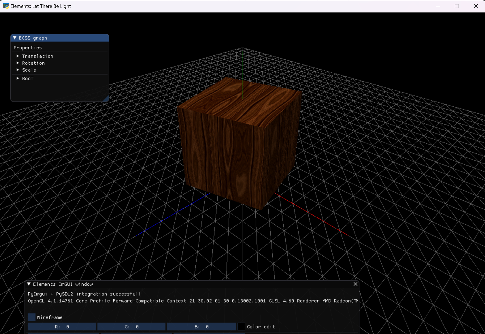

Introduction
========================

The pyGLV library offers visualization examples using the ECSS.

.. note:: 
    We use **SDL2** and **OpenGL** to render the content, **HLSL** to create vertex and fragment shaders and the **IMGUI** library to add realtime UIs to our apps.

This package is the python version of `glGA <https://github.com/papagiannakis/glGA-edu>`_  framework which is a lightweight, shader-based, comprehensive and easy to understand
computer graphics (CG) teaching C++ system that is used for educational purposes, with emphasis on modern graphics and GPU application programming.

You can read more about the glGA `here <https://diglib.eg.org/handle/10.2312/eged.20141026.009-016>`_

However, this is a python version of this graphics educational framework which makes it very easy to configure it and learn the basics of low level computer graphics.

Here are some interesting features about this library:

1. This library contains various examples of 3D scenes with the ECSS architecture. We advise you to run the examples and see how we can create the 3D apps from its fundamentals.

2. There is build-in 3D mesh importer. Check the **example_6_import_objects.py**

3. This library introduces the **Scene** class. A helper class that holds the reference to the 3D world and the render functionalities.

4. You are able to write your own **shaders using HLSL**. Those shaders are programs that run directly to your GPU.

5. We integrated the **IMGUI library** for easy manipulation of the 3D scenes. For example you can modify the transformation matrices of the 3D objects or modify the camera parameters.

6. Our examples implement the basic **Phong lighting** through shaders.

This library is great to learn the fundamentals of computer graphics!
