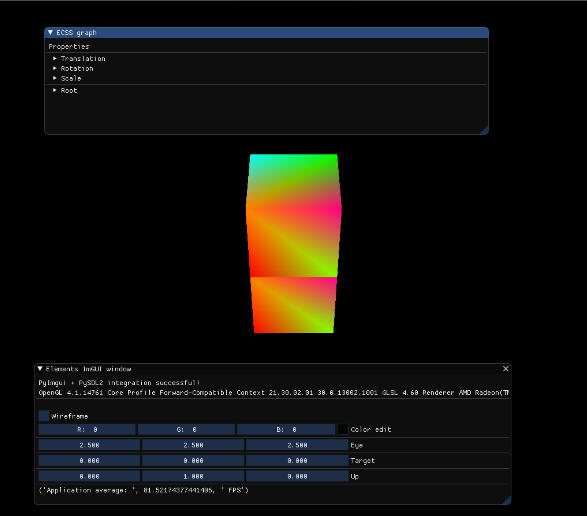
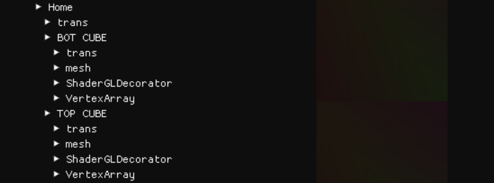

How to create a simple 3D scene
=================================

In this tutorial we will go throught the example **example_7_cameraSystem.py** where we will build a scene with two cubes and a camera.

The final result looks like this:

Create the scene and the camera
--------------------------------------

The code below creates the scene and adds a camera

.. code-block:: python

    # Scenegraph with Entities, Components
    rootEntity = scene.world.createEntity(Entity(name="Root"))

    # Spawn Camera
    mainCamera = SimpleCamera("Simple Camera");

As you see we currently have only a single Entity to our scene. The camera is a system, it traverses the scene to render the content with the code below

.. code-block:: python

    scene.world.traverse_visit_pre_camera(camUpdate, mainCamera.camera)

Create the cube
------------------

Now lets add some cubes to the scene

.. code-block:: python

    cube_bot: GameObjectEntity = CubeSpawn("BOT CUBE")
    scene.world.addEntityChild(home1, cube_bot);
    cube_top: GameObjectEntity = CubeSpawn()

This code block creates a cube entity and adds it to the scene under the "home1" entity. The :code:`CubeSpawn()` method initializes the vertices of our cube.

As you can see in the image above, this is the scenegraph hierarchy. All the entities and components are visible.

Put it all together
--------------------

In the main game loop we are doing the following

1. Traversing all the objects and update their transformations

.. code-block:: python

    scene.world.traverse_visit(transUpdate, scene.world.root) 

2. Update our camera. We can also manipulate the camera using real-time GUIs

.. code-block:: python

    scene.world.traverse_visit_pre_camera(camUpdate, mainCamera.camera)
    scene.world.traverse_visit(camUpdate, scene.world.root)

3. Call the :code:`renderUpdate` system to render the scene

.. code-block:: python

    scene.world.traverse_visit(renderUpdate, scene.world.root)

.. note:: 
    
    Keep in mind that the :code:`transUpdate`, the :code:`camUpdate` and the :code:`renderUpdate` are systems.
    The :code:`traverse_visit` method visits all the entities of our scenegraph and applies the given system when applicable.

