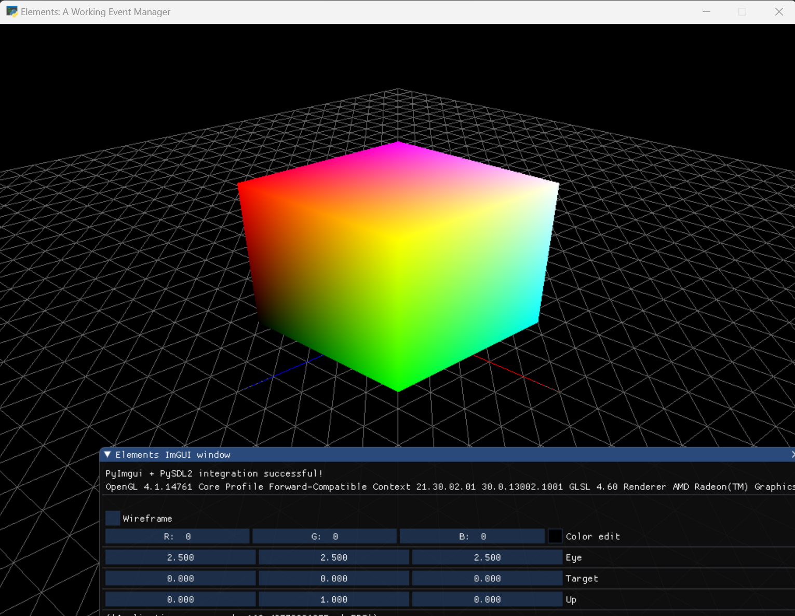

How to create a simple 3D scene
=================================

In this tutorial we will go throught the example **example_4_cube_axes_terrain.py** where we will build a scene with a cube, axes and a terrain.

The final result looks like this:

