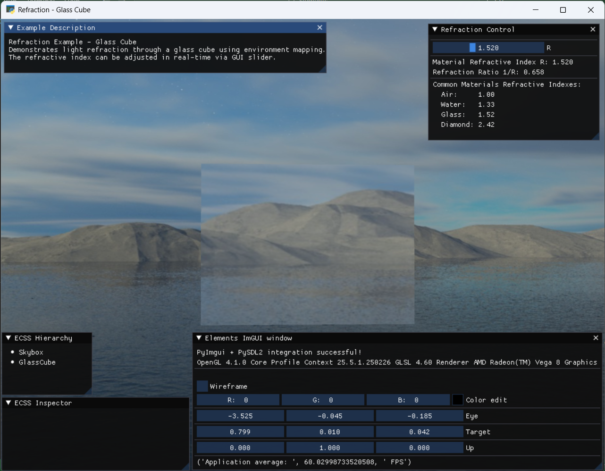
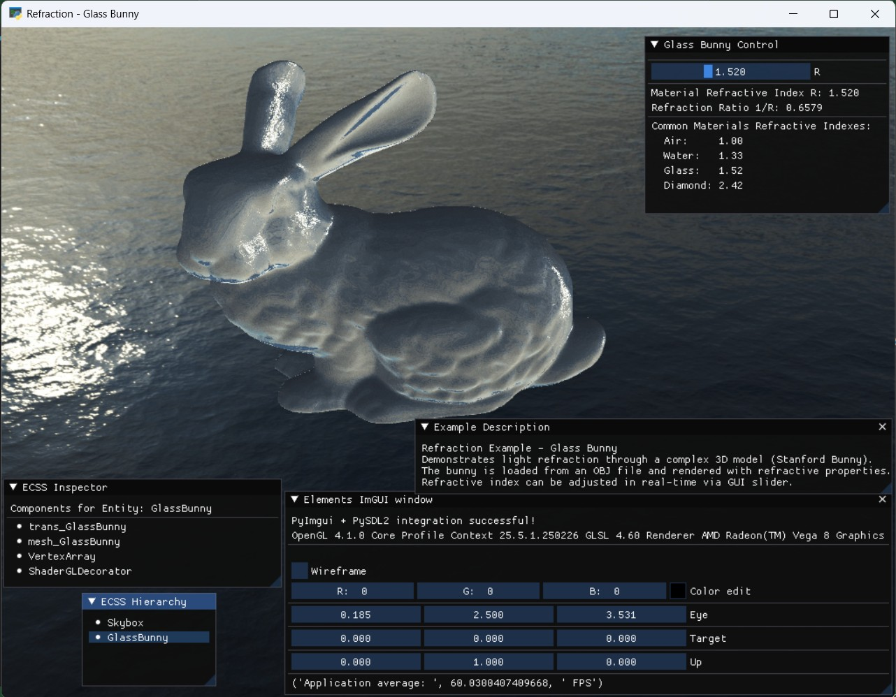

# Refraction Extension

Katerina Gyparaki  
csd4621@csd.uoc.gr  
Class of 2025

## Description

- This extension implements realistic light refraction for transparent/glass-like objects using environment mapping and Snell's Law. 
- The refraction effect is achieved through custom shaders that calculate how light bends as it passes through materials with different refractive indices.

## Features

- Real-time adjustable refractive index (1.0 - 2.5)
- Environment cubemap sampling for realistic reflections
- Support for both simple and complex geometries
- Optimized for large meshes (70k+ vertices)
- Smooth shading with automatic normal calculation

## Files

- `refraction_component.py` - Core component factory for creating refractive entities
- `refraction_example_cube.py` - Simple cube demonstration
- `refraction_example_bunny.py` - Complex geometry demonstration (Stanford Bunny)
- `tests/` - Unit tests for validation

The Stanford Bunny model itself (`bunny.obj`) ships with Elements, alongside every other
bundled model under `Elements/assets/models` (`Elements.definitions.MODEL_DIR`).

## Examples

### Glass Cube Ouput


A simple cube demonstrating basic refraction with adjustable refractive index.


### Glass Bunny Output


Stanford Bunny model (70k+ vertices) showing refraction on complex geometry.

## Usage

```python
from refraction_component import create_refractive_entity

# Create a refractive entity
entity, transform, shader = create_refractive_entity(
    scene, 
    parent, 
    "ObjectName", 
    vertices, 
    indices
)

# Set refractive index in render loop
ratio = 1.0 / refractive_index
shader.setUniformVariable(key='u_Ratio', value=ratio, float1=True)
```

## Running the Examples

```bash
# Glass cube
python refraction_example_cube.py

# Glass bunny
python refraction_example_bunny.py
```

## Running Tests

```bash
cd tests
python test_normal_calculation.py
python test_component_creation.py
```

## Common Materials Refractive Indices

| Material | Refractive Index |
|----------|------------------|
| Air      | 1.00             |
| Water    | 1.33             |
| Glass    | 1.52             |
| Diamond  | 2.42             |

## Technical Details

The refraction shader uses:
- Standard.vert for vertex transformations
- Custom fragment shader implementing `refract()` GLSL function
- Cubemap environment sampling
- Normal flipping for correct back-face refraction
- Total internal reflection fallback
